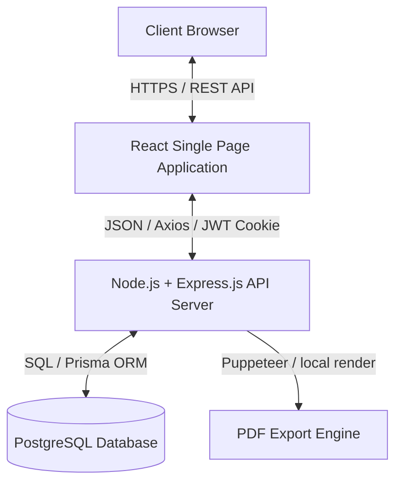
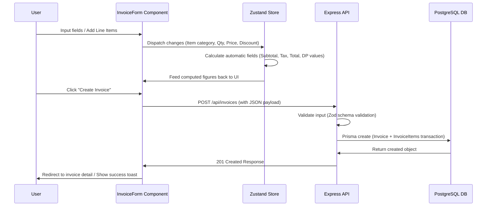

# Design Document: Invora Invoicing Platform
**Date:** 2026-06-13
**Status:** Approved

---

## 1. System Architecture

Invora is built as a client-server web application utilizing a clean separation of concerns.

### 1.1 Architecture Components
*   **Frontend**: A responsive Single Page Application (SPA) built using React 18, TypeScript, and Tailwind CSS. State management is handled globally by Zustand and locally via standard React state hooks.
*   **Backend**: Node.js and Express.js REST API server handling request validation, business logic, authentication, and database migrations.
*   **Database**: PostgreSQL relational database managed using Prisma ORM.
*   **PDF Export Engine**: Server-side rendering using Puppeteer or client-side generation using `react-pdf` to output A4-formatted, print-ready PDFs.

---

## 2. Component and Page Structure

### 2.1 Page Mapping
*   `/login` & `/register`: Session management pages.
*   `/dashboard`: High-level metrics showing revenue, unpaid/pending invoices, and overdue tracking.
*   `/invoices`: Search, paginated list, and multi-faceted filtering.
*   `/invoices/new` & `/invoices/:id/edit`: Dynamic invoice builder forms.
*   `/settings/company` & `/settings/profile`: Configuration of organization data, banking info, and personal profiles.

### 2.2 Reusable Components
*   `InvoiceForm`: Single cohesive form handling regular, proforma, DP, and pelunasan logic.
*   `LineItemsEditor`: Dynamic list manager for adding/removing/updating product and service line items.
*   `InvoicePreview`: Live rendered preview conforming to A4 dimensions.
*   `StatusBadge` & `InvoiceTypeBadge`: Color-coded semantic visual feedback indicators.

---

## 3. Data Flow

### 3.1 Invoice Creation & Calculation Flow

---

## 4. Error Handling & Security

### 4.1 Authentication & Authorization
*   **Authentication**: JWT issued upon successful authentication, stored securely in an `httpOnly` cookie.
*   **Authorization**: Middleware on Express routes to check JWT validity and restrict resource queries to the active `userId`.

### 4.2 Error Handling Strategy
*   **Backend Validation**: API endpoints validate incoming payloads using Zod. Validation errors are returned with detailed 400 Bad Request status payloads.
*   **Global Error Handling**: Express middleware intercepts unhandled promises or runtime exceptions, returning a clean 500 error structure without exposing system stack traces.
*   **Frontend Alerts**: Axios interceptors handle 401/403 redirects and display contextual user feedback using standard toast notifications (success/error).

---

## 5. Testing Strategy

*   **Unit Testing**: Vitest for utility math functions (tax, subtotal, DP percentage calculations).
*   **Integration Testing**: Supertest for validating critical authentication and CRUD REST endpoints.
*   **End-to-End Testing**: Playwright tests to verify the core invoice creation user journey (form input, draft generation, and preview mode rendering).
