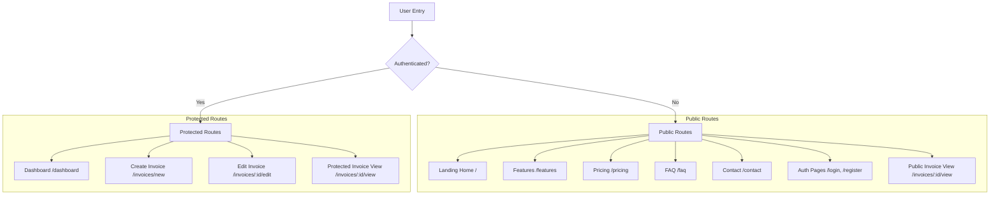

# Design Specification: Invora Full-Stack Redesign & Feature Expansion

This document details the system design, UI/UX structure, and technical requirements for the redesign and feature expansion of the **Invora Invoicing Platform**.

---

## 1. System Architecture & Route Blueprint

Invora will employ a multi-route Single Page Application (SPA) architecture with React Router. The routing is partitioned into **Public Routes** (accessible by everyone) and **Protected Routes** (requiring active authentication sessions).



---

## 2. Page & Component Designs

### 2.1 Public Landing Site (Redesign)
* **Global Theme**: Sleek deep-dark space aesthetic (`#0B132B` primary background, `#1C2541` secondary panels, `#00A8CC` neon cyan accents, and `#6F2DBD` purple glows).
* **Landing Home (`/`)**:
  * Hero Section: High-impact typography utilizing Google Fonts (Outfit/Inter). Interactive CTA buttons.
  * Live Interactive Mock Invoice: A static invoice component loaded with default values. Users can interact with input sliders (e.g., adjust discount, toggle currency, change client name) to watch the mockup invoice update instantly.
* **Features (`/features`)**: A grid displaying details of the application: Cloud database storage, multi-currency support, custom signature, print-ready format.
* **Pricing (`/pricing`)**: Three glassmorphic cards comparing Free, Pro, and Enterprise tiers. The Pro card features a pulsing border neon animation.
* **FAQ (`/faq`)**: A series of accordion items with smooth collapse transitions for questions and answers.
* **Contact (`/contact`)**: A clean input form for support inquiries with input animations.

### 2.2 Live Invoice Preview (Form Flow)
* **Placement**: Located directly below the main form layout inside `InvoiceForm.tsx` (revealed/hidden by a "Show Preview" toggle button).
* **Styling**: Formatted as a realistic white sheet of A4 paper with paper shadows (`shadow-2xl`) to stand out against the dark dashboard styling.
* **Dual Language Mode (ID/EN)**: A switch at the top of the preview to change invoice labels:
  * English: `Invoice Date`, `Due Date`, `Billed From`, `Billed To`, `Description`, `Subtotal`, `Total`.
  * Indonesian: `Tanggal Invoice`, `Jatuh Tempo`, `Tagihan Dari`, `Tagihan Kepada`, `Deskripsi`, `Subtotal`, `Total`.
* **Notes & Terms**: Rendered in structured blocks:
  ```text
  Notes
  {notes_content}

  Terms & Conditions
  {terms_content}
  ```
* **Thank You Message**: Text input labeled "Thank You Message". Pre-populated with default localized message:
  * English: "Thank you for your business!"
  * Indonesian: "Terima kasih atas kerja sama Anda!"

### 2.3 Logo & Signature Implementation
* **Company Logo**: Optional field in the Company Profile modal. File drop-zone converts the uploaded image file to a base64 Data URL and saves it to the `logo` field in the database.
* **Signature Pad**: Integrates a signature input area in the Invoice Form:
  * **Draw Tab**: An interactive HTML5 canvas allowing drawing with mouse/touch coordinates. A "Clear" button resets the canvas. Saves as a base64 PNG data URL on submit.
  * **Upload Tab**: Simple image input that reads the uploaded signature as a base64 Data URL.

---

## 3. Database & API Endpoints

### 3.1 Schema Consistency
We will utilize the existing PostgreSQL columns for Base64 image storage:
* `Company.logo` (nullable `String`/`text` in database)
* `Invoice.signature` (nullable `String`/`text` in database)

### 3.2 Duplicate Prevention
* Prior to creating a new `Company` or `Client`, the backend will check for existing records under the same `userId` with the identical case-insensitive name.
* Endpoint: `POST /api/companies` and `POST /api/clients` will return a `400` status with `{ error: "Name profile is already registered" }` if duplicate name matches.

### 3.3 Safe Profile Deletion
* **Endpoints**:
  * `DELETE /api/companies/:id`
  * `DELETE /api/clients/:id`
* **Validation**:
  * Before deletion, the backend performs a search in the `Invoice` table for records referencing `companyId` or `clientId`.
  * If references are found, it returns `400` status with `{ error: "This profile is currently used in one or more invoices and cannot be deleted." }`.
  * Otherwise, it completes the deletion securely.

---

## 4. Test & Verification Plan

1. **Unit Verification**:
   * Verify base64 generation and canvas drawing operations.
   * Verify duplicate validation on database inserts.
2. **E2E Browser Validation**:
   * Navigate through the public routes (`/`, `/features`, `/pricing`, `/faq`, `/contact`).
   * Test profile deletion and verify duplicate prevention warnings.
   * Verify toggle languages (ID/EN) inside the Invoice Preview form.
